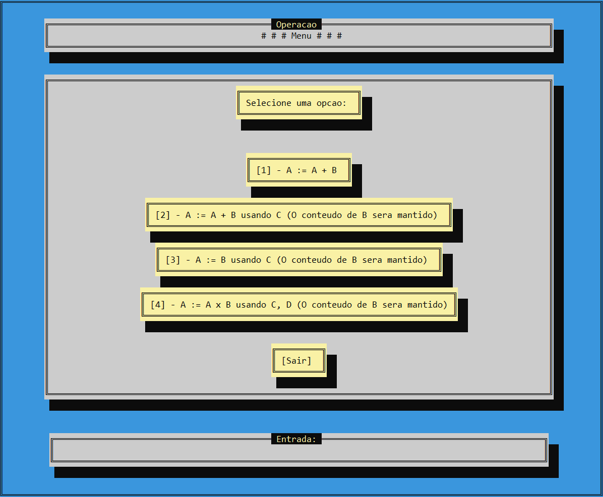
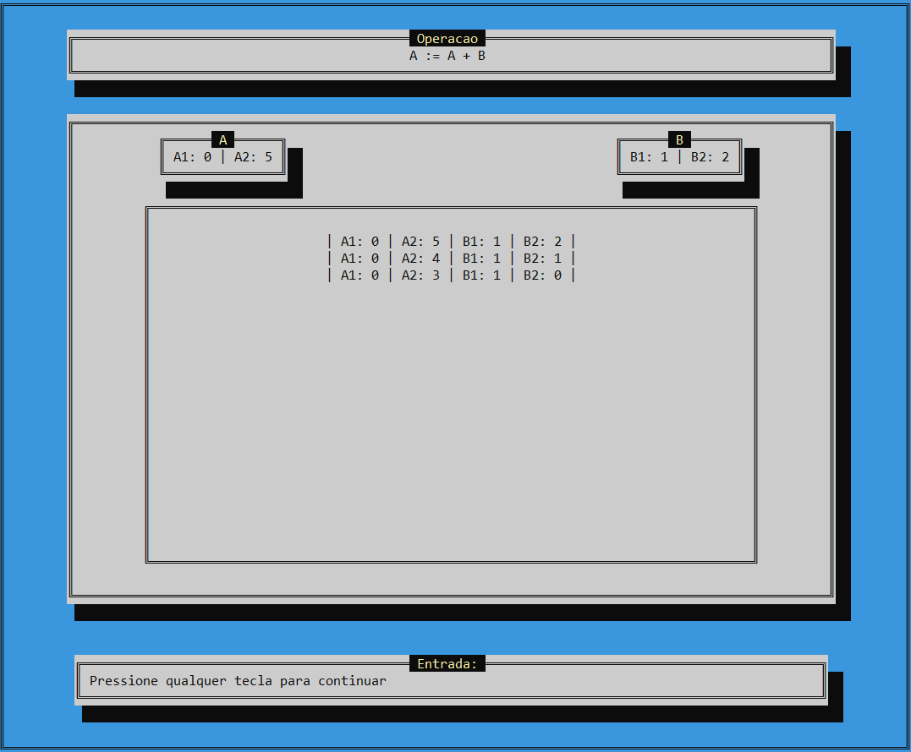
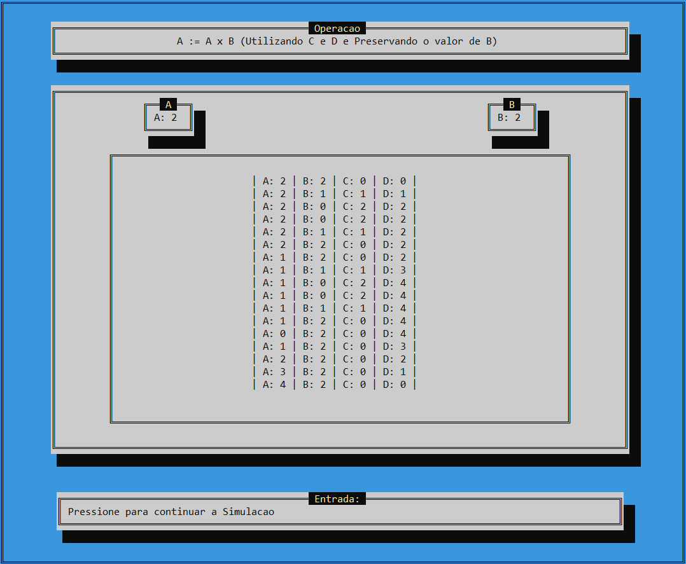
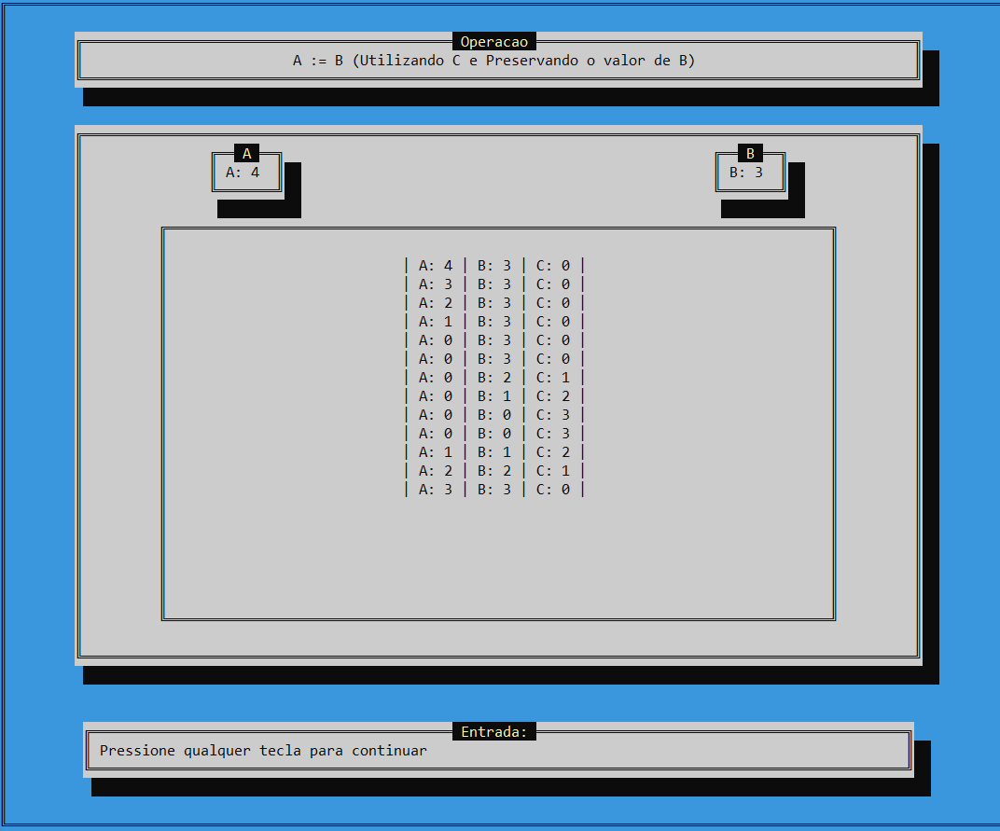

# 🧮 Simulador de Máquina Norma

💻 **Disciplina:** Teoria da Computação  
📚 **Curso:** Ciência da Computação — FIPP / UNOESTE  
👨‍💻 **Autor:** Matheus Oliveira da Silva  

---

## 📖 Sobre o Projeto

Este projeto implementa um **simulador de Máquina Norma** com **interface visual em modo texto (Conio2)**.

O objetivo é **demonstrar o funcionamento lógico de uma Máquina Norma**, modelo teórico fundamental para o estudo da **Computabilidade**, permitindo a execução passo a passo de **operações entre registradores (A, B, C, D)**, simulando instruções de soma, atribuição e multiplicação.

---

## 🎯 Objetivos

- Compreender o **modelo teórico da Máquina Norma** e suas operações fundamentais.  
- Simular o comportamento de registradores e instruções básicas.  
- Ilustrar, de forma visual, como uma **máquina abstrata** realiza cálculos a partir de comandos simples.  
- Reforçar os conceitos de **algoritmos computáveis** e **modelos de execução sequencial**.  
- Oferecer uma **interface amigável e interativa** em modo texto utilizando **Conio2**.

---

## ⚙️ Funcionalidades Principais

- 🔹 **A := A + B** — Soma o conteúdo de B em A.  
- 🔹 **A := A + B usando C** — Soma o conteúdo de B em A, preservando o valor original de B.  
- 🔹 **A := B usando C** — Copia o conteúdo de B para A, mantendo B inalterado.  
- 🔹 **A := A × B usando C, D** — Multiplica A por B, preservando o conteúdo de B.  
- 🔹 **Interface visual** com menus, cores e molduras utilizando **Conio2**.  
- 🔹 **Mensagens e feedbacks interativos** durante as operações.  

---

## 🔄 Funcionamento do Simulador

Durante a execução:

1. O usuário escolhe uma **operação** no menu principal.  
2. A operação é executada passo a passo, manipulando os registradores conforme o comando.  
3. A interface mostra os resultados intermediários e finais de cada cálculo.  
4. Ao final, o usuário pode continuar executando outras operações até optar por sair.

---

## 🖼️ Interface do Simulador

O programa utiliza **Conio2** para apresentar os estados e transições de processos em uma interface visual no console:

---

## ➕ Operação de soma

Demonstração da execução da operação **A := A + B**, mostrando o resultado da soma entre os registradores:

---

## ✖️ Operação de multiplicação

Exemplo da operação **A := A × B**, utilizando os registradores auxiliares **C** e **D** para preservar o valor de **B**:

---

## 🔁 Operação de atribuição

Demonstração da operação **A := B**, copiando o conteúdo do registrador **B** para **A** sem alterar o original:

